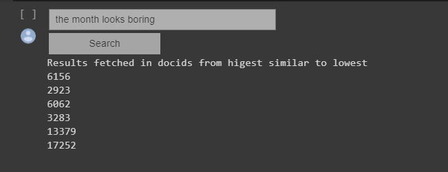

# Implementing an inverted index :metal:

This project is about implementing an inverted index using Apache Spark for building the
index and a relational database (e.g. SQLite) for storing the index. We are using Python (PySpark) for this project. Storing the index in a database offers the benefit of using the B-Tree data structure offered by a relational database instead of building it from the scratch. 

## What we are doing :cloud:
1. Build the index using a document collection.  
2. Create database tables for storing the inverted index.  
3. Implement the keyword search functionality.  
4. Implement result ranking using the TF-IDF measure.  
5. Implement a simple interface for giving keyword queries and showing results.  

## Packages and Software used :computer:
Python(Pyspark)  
SQLite  
NLTK package  
Google Colab  

## Insights :pencil:

